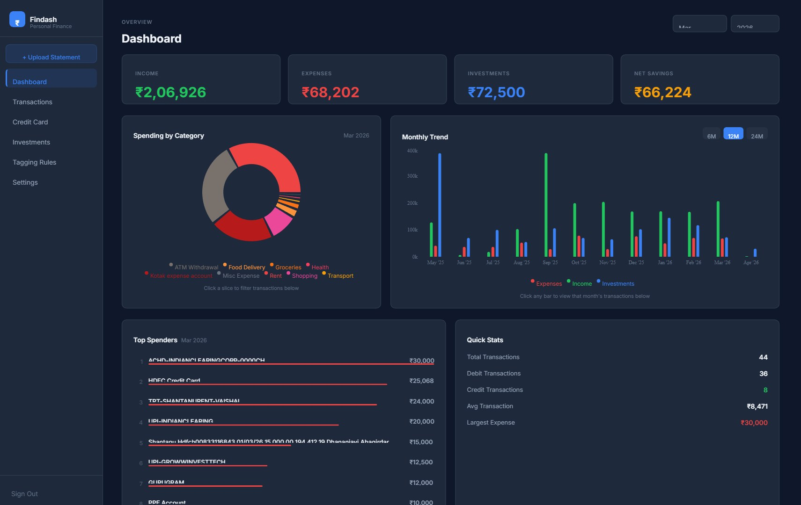
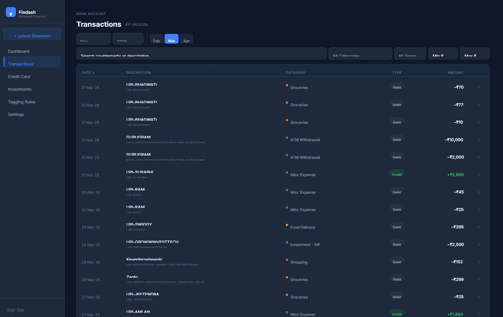
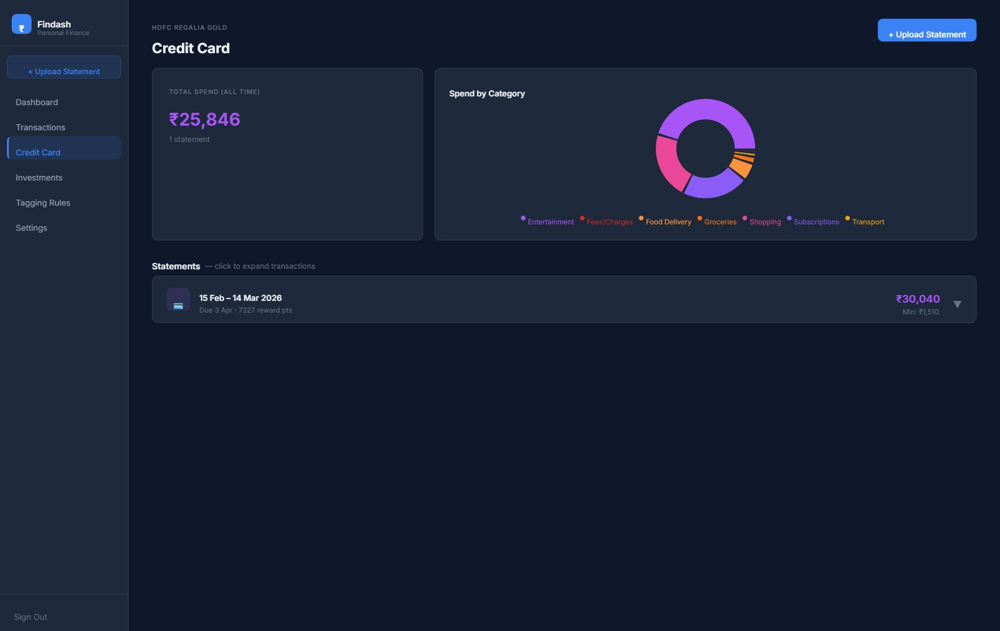
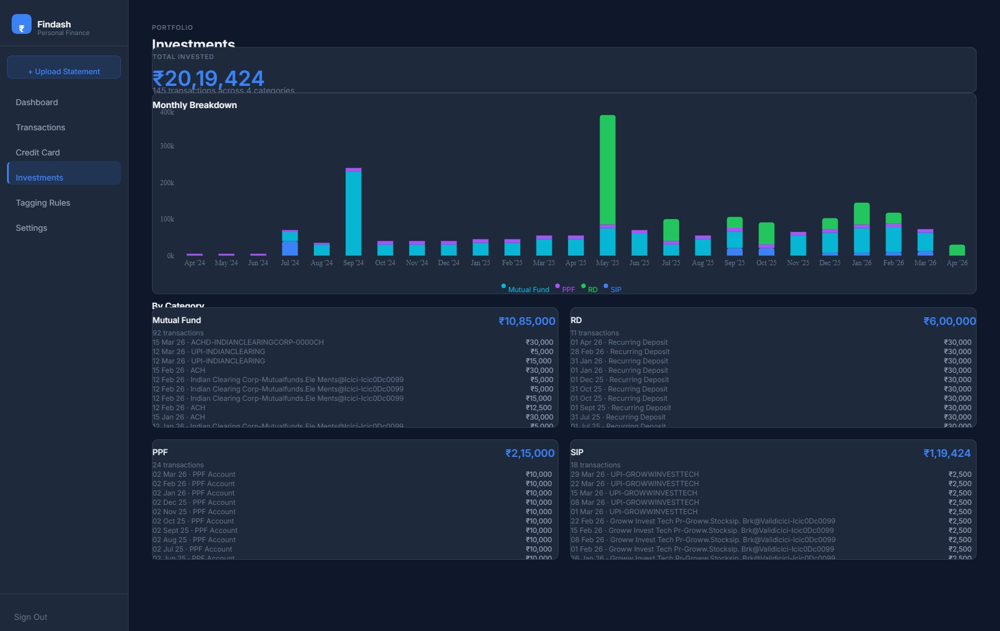
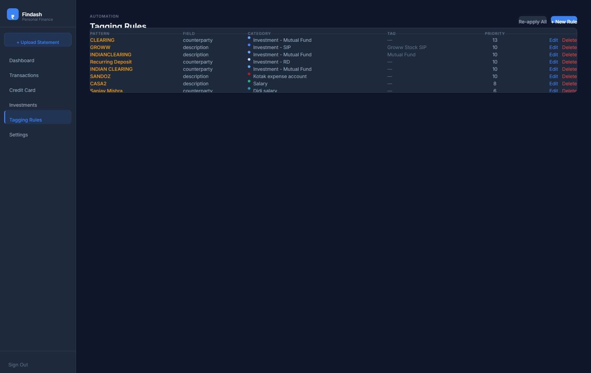
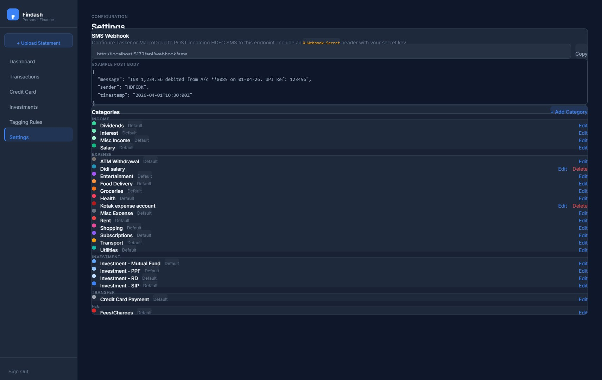

# Findash — Personal Finance Dashboard

A self-hosted personal finance dashboard for tracking bank transactions, credit card spend, and investments. Parses PDF bank statements, auto-categorises transactions with configurable rules, and visualises everything in a clean dark-mode UI.

Runs fully locally — your data never leaves your machine.

---

## Screenshots

### Dashboard
> Monthly overview with income/expense/investment cards, interactive spending pie, monthly trend bar chart, top spenders, and quick stats.



### Transactions
> Filterable, sortable table with inline type-toggle (debit↔credit), inline category editing, amount range filter, and delete.



### Credit Card
> Statement-level breakdown with spend-by-category donut and per-statement transaction list.



### Investments
> Total portfolio value with monthly contribution chart and per-category (MF / SIP / RD / PPF) transaction drill-down.



### Tagging Rules
> Keyword → category rules with pattern matching, priority ordering, and one-click bulk re-apply.



### Settings
> Category management (create / edit / delete with color picker) and webhook configuration.



---

## Features

**Dashboard**
- All-time, year-only, or month-level views — pick any combination
- Click a bar in the trend chart to jump directly to that month
- Click a pie slice to filter the transaction table below
- Top 8 spenders with proportional bar visualisation
- Quick stats: total, debit/credit counts, average and largest transaction
- Uncategorized badge — click it to jump straight to `/transactions?filter=uncategorized`

**Transactions**
- Full-text search across counterparty and description
- Filter by category, type (debit / credit), amount range, or "Uncategorized only"
- Quick month-jump buttons (3 months either side of current)
- Sortable columns: date, amount, type, counterparty
- Inline type toggle — click Debit/Credit badge to flip misclassified transactions
- Inline category editing — click any category cell to reassign
- Delete with 2-click confirmation
- Deep-linkable via URL params (`?filter=uncategorized`, `?month=3&year=2026`)

**Credit Card**
- Per-account statement tracking with cycle dates and totals
- Spend-by-category donut chart
- Upload statements directly from the Credit Card page
- INTL and EMI badges on relevant transactions

**Investments**
- Aggregates across Mutual Funds, SIP, RD, and PPF
- Monthly contribution bar chart with per-category breakdown
- Per-transaction list inside each category card

**Tagging Rules**
- Pattern matching on counterparty, description, or reference fields
- Priority ordering — higher priority rules win on conflicts
- One-click "Re-apply All" to re-categorise your entire transaction history
- Live preview: test a rule against existing transactions before saving

**Statements**
- Upload PDF bank statements via a modal (sidebar button or Credit Card page)
- Python parser (`pdf-to-md/`) handles HDFC account and HDFC credit card formats
- Debit/credit auto-detection via running balance verification
- Manual type override via `type_corrections.json` (or flip from the UI)

---

## Tech Stack

| Layer | Technology |
|---|---|
| Frontend | React 19, React Router v7, Recharts, Tailwind CSS v4 |
| Backend | Python 3, FastAPI, SQLModel (`server-py/`) |
| Database | SQLite |
| Auth | JWT (HS256), bcrypt password hash |
| Parsing | Python 3, pdfplumber, pandas, xlrd/openpyxl |
| Deployment | Single Docker image (Node builds client, Python serves all) |
| Font / Theme | Inter, slate dark palette (`#0f172a` base) |

> The backend was migrated from Node/Express to FastAPI (see `server-py/README.md`).
> The legacy Node server under `server/` is kept temporarily as a fallback.

---

## Getting Started

### Prerequisites
- Node.js 18+
- Python 3.10+ (for statement parsing only)

### 1. Clone

```bash
git clone https://github.com/shan8tanu/personal-finance-dashboard.git
cd personal-finance-dashboard
```

### 2. Install dependencies

```bash
# Server
cd server && npm install

# Client
cd ../client && npm install
```

### 3. Configure environment

```bash
cp server/.env.example server/.env   # if example exists, else create manually
```

Edit `server/.env`:

```env
DATABASE_URL="file:./dev.db"
JWT_SECRET="your-random-secret-here"
AUTH_USERNAME="yourname"
AUTH_PASSWORD_HASH="<bcrypt hash of your password>"
PORT=3001
```

Generate a bcrypt hash for your password:
```bash
node -e "const b=require('bcryptjs'); b.hash('yourpassword',10).then(console.log)"
```

### 4. Set up the database

```bash
cd server
npx prisma migrate dev
npx prisma generate
npm run seed   # optional: seeds categories and sample rules
```

### 5. Run

Open two terminals:

```bash
# Terminal 1 — backend
cd server && npm run dev

# Terminal 2 — frontend
cd client && npm run dev
```

Open [http://localhost:5173](http://localhost:5173) and sign in with your configured credentials.

---

## Importing Bank Statements

The easiest path is the UI — click **+ Upload Statement** in the sidebar (or on the
Credit Card page) and drop in an HDFC PDF or Excel (`.xls` / `.xlsx`) statement.

Under the hood, statements are parsed by the Python parsers in `server/src/parsers/`:

| File | Handles |
|---|---|
| `parse_bank_statement.py` | HDFC savings account PDF |
| `parse_bank_statement_xls.py` | HDFC savings account Excel (`.xls` / `.xlsx`) |
| `parse_cc_statement.py` | HDFC credit-card PDF |

The backend invokes the right parser automatically based on file type and account, so
you don't run them by hand.

---

## Project Structure

```
.
├── client/                  # React frontend (Vite)
│   └── src/
│       ├── pages/           # Dashboard, Transactions, CreditCard, Investments, …
│       ├── components/      # Layout, UploadModal
│       └── services/api.ts  # Typed API client
├── server/                  # Express backend
│   └── src/
│       ├── routes/          # transactions, analytics, auth, upload, …
│       ├── middleware/       # JWT auth
│       └── generated/       # Prisma client
│       └── parsers/         # Python statement parsers (PDF + Excel)
└── docs/screenshots/        # UI screenshots
```

---

## License

Personal project — not licensed for redistribution.
